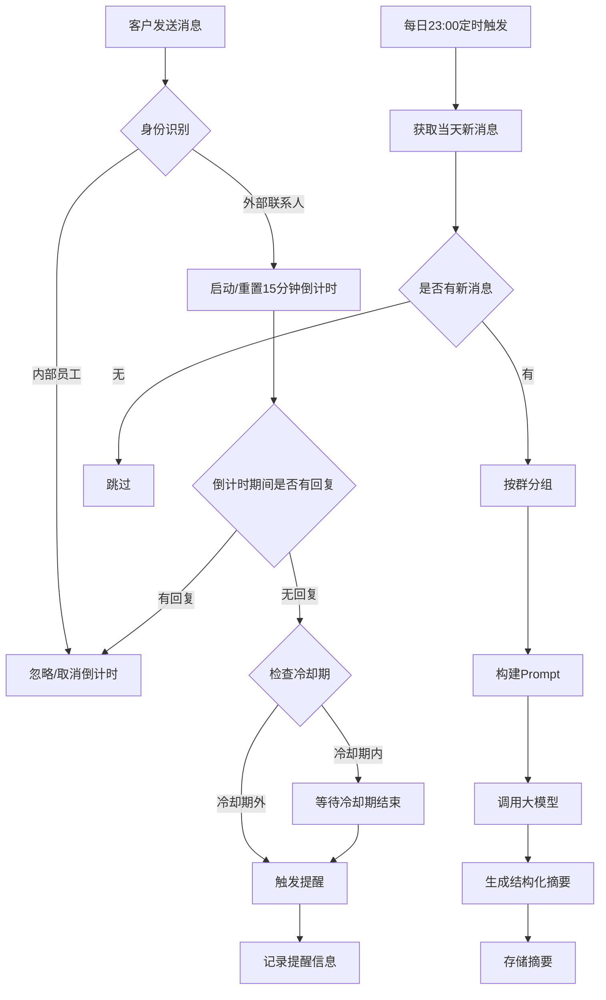

## 1. Product Overview
企微聊天记录智能管理平台，为企业微信客户服务群提供会话存档、每日智能摘要分析以及15分钟无回复自动提醒功能，提升客户服务质量与响应效率。

## 2. Core Features

### 2.1 User Roles
| Role | Registration Method | Core Permissions |
|------|---------------------|------------------|
| 管理员 | 内部账号登录 | 管理所有功能、查看所有数据、配置参数 |
| 客服 | 内部账号登录 | 查看分配的群聊摘要、接收提醒通知 |

### 2.2 Feature Module
1. **仪表盘**: 服务概览、今日统计、快速入口
2. **会话摘要列表**: 按日期/群筛选、摘要卡片展示、详情查看
3. **会话摘要详情**: 完整摘要内容、标签分类、相关聊天记录
4. **提醒管理**: 提醒记录列表、统计分析、处理状态
5. **系统配置**: 定时任务设置、提醒规则配置、群管理

### 2.3 Page Details
| Page Name | Module Name | Feature description |
|-----------|-------------|---------------------|
| 仪表盘 | 服务概览 | 展示今日咨询量、响应时效、问题闭环率等核心指标 |
| 仪表盘 | 统计卡片 | 快速展示关键数据，支持点击跳转 |
| 会话摘要列表 | 筛选区 | 按日期范围、群名称、标签进行筛选 |
| 会话摘要列表 | 摘要卡片 | 显示群名、日期、摘要预览、标签、服务评价 |
| 会话摘要详情 | 摘要内容 | 完整展示大模型生成的结构化摘要 |
| 会话摘要详情 | 标签展示 | 关键标签可视化展示 |
| 会话摘要详情 | 相关记录 | 关联的原始聊天记录概览 |
| 提醒管理 | 提醒列表 | 展示所有触发的提醒记录，支持筛选和搜索 |
| 提醒管理 | 统计分析 | 响应时效统计、提醒频率分析 |
| 系统配置 | 定时任务 | 设置每日摘要生成时间 |
| 系统配置 | 提醒规则 | 配置无回复提醒时长、冷却时间等 |
| 系统配置 | 群管理 | 管理需要监控的客户群 |

## 3. Core Process

## 4. User Interface Design

### 4.1 Design Style
- **主色调**: 专业商务蓝 (#1e40af)，体现企业级应用的可靠性
- **辅助色**: 绿色表示已解决 (#16a34a)，橙色表示待处理 (#f97316)，红色表示投诉/未解决 (#dc2626)
- **按钮风格**: 圆角矩形、渐变填充、悬停状态有明显反馈
- **字体**: 标题使用 Inter 粗体，正文使用 Inter 常规体
- **布局**: 卡片式布局，左侧导航，右侧内容区，清晰的信息层级
- **图标**: 使用 Lucide React 图标库，简约现代风格

### 4.2 Page Design Overview

#### 仪表盘
| Module Name | UI Elements |
|-------------|-------------|
| 服务概览 | 顶部大标题、副标题、日期选择器 |
| 统计卡片 | 4个横向排列的卡片，包含图标、数值、同比变化 |
| 趋势图 | 响应时效趋势折线图 |

#### 会话摘要列表
| Module Name | UI Elements |
|-------------|-------------|
| 筛选区 | 日期范围选择器、群名称下拉框、标签多选框、搜索框 |
| 摘要卡片 | 白色圆角卡片，显示群名、日期、摘要预览、彩色标签、服务评分 |

#### 会话摘要详情
| Module Name | UI Elements |
|-------------|-------------|
| 头部信息 | 返回按钮、群名称、日期、服务评价等级 |
| 标签展示 | 彩色标签徽章横向排列 |
| 摘要内容 | 分段展示：客户咨询、处理过程、问题状态、服务评价 |
| 相关记录 | 折叠区域，展示原始聊天记录概览 |

#### 提醒管理
| Module Name | UI Elements |
|-------------|-------------|
| 提醒列表 | 表格形式，包含时间、群名、被@人员、状态、操作 |
| 统计分析 | 响应时效统计卡片、提醒频率柱状图 |

#### 系统配置
| Module Name | UI Elements |
|-------------|-------------|
| 定时任务 | 时间选择器、开关按钮 |
| 提醒规则 | 输入框、数值调整器 |
| 群管理 | 群列表、添加/删除操作 |

### 4.3 Responsiveness
- **桌面端**: 完整功能展示，左侧固定导航，右侧内容区自适应
- **平板端**: 导航折叠为图标，内容区保持两列布局
- **移动端**: 导航转为底部标签栏，内容区单列布局，卡片堆叠展示

### 4.4 3D Scene Guidance
不适用