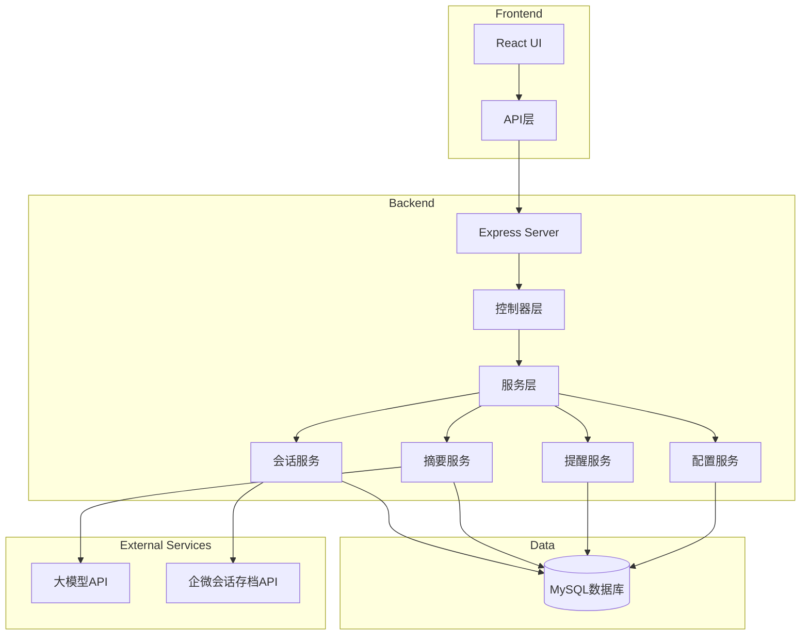
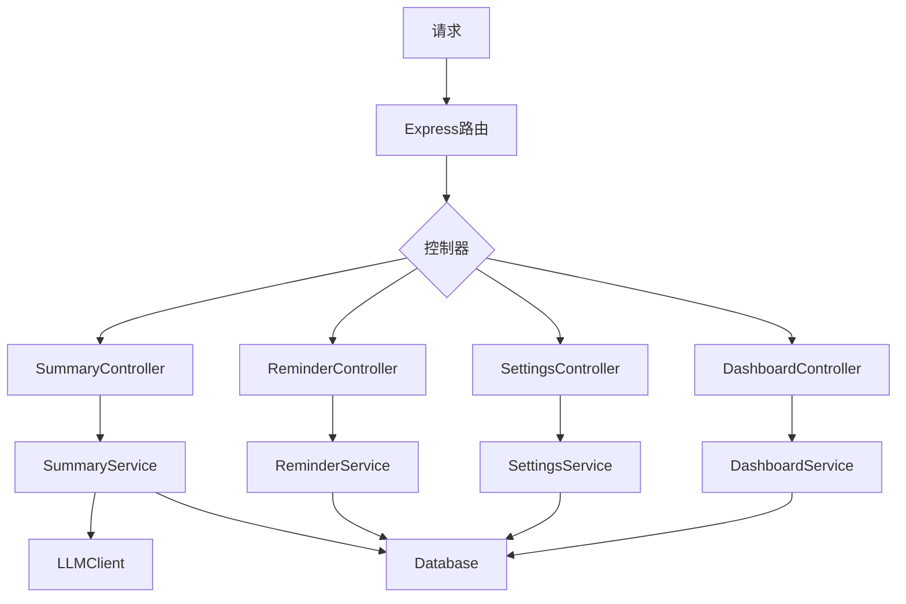
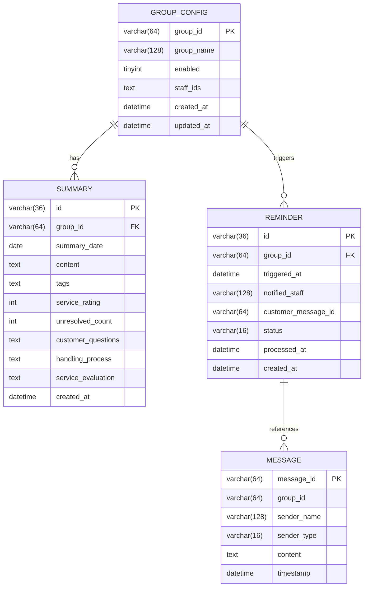

## 1. Architecture Design



## 2. Technology Description

* Frontend: React\@18 + TypeScript + TailwindCSS\@3 + Vite

* Backend: Express\@4 + TypeScript

* Database: MySQL 8.0+

* State Management: Zustand

* Icons: Lucide React

* HTTP Client: Axios

## 3. Route Definitions

| Route          | Purpose |
| -------------- | ------- |
| /              | 仪表盘     |
| /summaries     | 会话摘要列表  |
| /summaries/:id | 会话摘要详情  |
| /reminders     | 提醒管理    |
| /settings      | 系统配置    |

## 4. API Definitions

### 4.1 会话摘要 API

#### GET /api/summaries

获取会话摘要列表

**请求参数:**

```typescript
interface GetSummariesParams {
  dateStart?: string;  // YYYY-MM-DD
  dateEnd?: string;    // YYYY-MM-DD
  groupId?: string;
  tags?: string[];
  page?: number;
  pageSize?: number;
}
```

**响应:**

```typescript
interface Summary {
  id: string;
  groupId: string;
  groupName: string;
  date: string;
  content: string;
  tags: string[];
  serviceRating: number;  // 1-5
  unresolvedCount: number;
  createdAt: string;
}

interface GetSummariesResponse {
  data: Summary[];
  total: number;
  page: number;
  pageSize: number;
}
```

#### GET /api/summaries/:id

获取会话摘要详情

**响应:**

```typescript
interface SummaryDetail extends Summary {
  customerQuestions: string;
  handlingProcess: string;
  serviceEvaluation: string;
  relatedMessages: MessagePreview[];
}

interface MessagePreview {
  id: string;
  senderName: string;
  senderType: 'customer' | 'staff';
  content: string;
  timestamp: string;
}
```

### 4.2 提醒管理 API

#### GET /api/reminders

获取提醒记录列表

**请求参数:**

```typescript
interface GetRemindersParams {
  dateStart?: string;
  dateEnd?: string;
  groupId?: string;
  status?: 'pending' | 'processed';
  page?: number;
  pageSize?: number;
}
```

**响应:**

```typescript
interface Reminder {
  id: string;
  groupId: string;
  groupName: string;
  triggeredAt: string;
  notifiedStaff: string;
  customerMessageId: string;
  status: 'pending' | 'processed';
  processedAt?: string;
}

interface GetRemindersResponse {
  data: Reminder[];
  total: number;
  page: number;
  pageSize: number;
}
```

#### PUT /api/reminders/:id/process

处理提醒

**响应:**

```typescript
interface ProcessReminderResponse {
  success: boolean;
  message: string;
}
```

#### GET /api/reminders/statistics

获取提醒统计数据

**响应:**

```typescript
interface ReminderStatistics {
  totalCount: number;
  pendingCount: number;
  avgResponseTime: number;  // 分钟
  trendData: { date: string; count: number }[];
}
```

### 4.3 系统配置 API

#### GET /api/settings

获取系统配置

**响应:**

```typescript
interface Settings {
  summaryTime: string;  // HH:mm
  reminderTimeout: number;  // 分钟
  reminderCooldown: number;  // 分钟
  monitoredGroups: GroupConfig[];
}

interface GroupConfig {
  groupId: string;
  groupName: string;
  enabled: boolean;
  staffIds: string[];
}
```

#### PUT /api/settings

更新系统配置

**请求体:**

```typescript
interface UpdateSettingsBody extends Partial<Settings> {}
```

#### POST /api/settings/groups

添加监控群

**请求体:**

```typescript
interface AddGroupBody {
  groupId: string;
  groupName: string;
  staffIds: string[];
}
```

#### DELETE /api/settings/groups/:groupId

删除监控群

### 4.4 仪表盘 API

#### GET /api/dashboard/stats

获取仪表盘统计数据

**响应:**

```typescript
interface DashboardStats {
  todayConsultations: number;
  avgResponseTime: number;
  resolutionRate: number;
  unresolvedCount: number;
  todayReminders: number;
  summaryCount: number;
}
```

## 5. Server Architecture Diagram



## 6. Data Model

### 6.1 Data Model Definition



### 6.2 Data Definition Language

```sql
CREATE TABLE group_config (
    group_id VARCHAR(64) PRIMARY KEY,
    group_name VARCHAR(128) NOT NULL,
    enabled TINYINT(1) DEFAULT 1,
    staff_ids TEXT,
    created_at DATETIME DEFAULT CURRENT_TIMESTAMP,
    updated_at DATETIME DEFAULT CURRENT_TIMESTAMP ON UPDATE CURRENT_TIMESTAMP
);

CREATE TABLE summary (
    id VARCHAR(36) PRIMARY KEY,
    group_id VARCHAR(64) NOT NULL,
    summary_date DATE NOT NULL,
    content TEXT NOT NULL,
    tags TEXT,
    service_rating INT CHECK (service_rating BETWEEN 1 AND 5),
    unresolved_count INT DEFAULT 0,
    customer_questions TEXT,
    handling_process TEXT,
    service_evaluation TEXT,
    created_at DATETIME DEFAULT CURRENT_TIMESTAMP,
    INDEX idx_group_date (group_id, summary_date)
);

CREATE TABLE reminder (
    id VARCHAR(36) PRIMARY KEY,
    group_id VARCHAR(64) NOT NULL,
    triggered_at DATETIME NOT NULL,
    notified_staff VARCHAR(128) NOT NULL,
    customer_message_id VARCHAR(64),
    status VARCHAR(16) DEFAULT 'pending',
    processed_at DATETIME,
    created_at DATETIME DEFAULT CURRENT_TIMESTAMP,
    INDEX idx_group_triggered (group_id, triggered_at),
    INDEX idx_status (status)
);

CREATE TABLE message (
    message_id VARCHAR(64) PRIMARY KEY,
    group_id VARCHAR(64) NOT NULL,
    sender_name VARCHAR(128) NOT NULL,
    sender_type VARCHAR(16) NOT NULL,
    content TEXT NOT NULL,
    timestamp DATETIME NOT NULL,
    INDEX idx_group_timestamp (group_id, timestamp)
);
```

